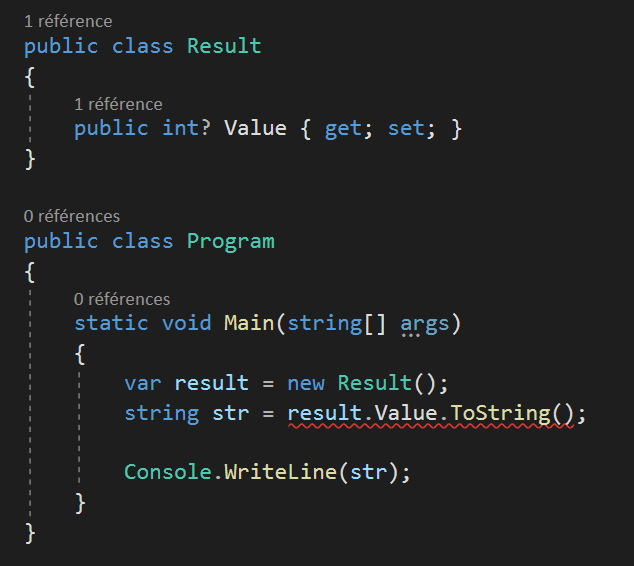

# Enable Nullable Reference Types

With C# 8.0, there are some useful features you can use. One of the new feature is made to mainly prevent `NullReferenceException` exceptions, which is called Nullable Reference Types.

If you want more info on this, please read the documentation: https://docs.microsoft.com/en-us/dotnet/csharp/nullable-references

### Enable the option in your project

#### New projects

For new projects like .NET Core 3.0 / .NET Standard 2.1, you can simply activate the feature in your csproj:

```xml
<Nullable>enable</Nullable>
```

#### Older projects

If you are using an older project, you need to specify the `LangVersion` in your projects that target a version before .NET Core 3.0 or .NET Standard 2.1.

```xml
<LangVersion>8.0</LangVersion>
<Nullable>enable</Nullable>
```

But you also need to compile your project with the help of the .NET Core SDK 3.0 or later. If you are using a CI system like Azure DevOps, there is task that will help you do it: https://docs.microsoft.com/en-us/azure/devops/pipelines/tasks/tool/dotnet-core-tool-installer?view=azure-devops

### Editor config

If you use Visual Studio as an IDE, you will see a lot of suggestions (rules) based on the language features, with different level of severity: warning, error, info, etc... With C# 8.0, there are new rules to detect nullable types, nullable assignments, etc... By default, most there rules are set to warning by default, here is how to change the severity for all NullableReferenceType rules.

Also, be sure you have Visual Studio 2019 v16.3 or later. These new rules are only available for the newest versions of Visual Studio.

There is a complete list of all the rules bound to this feature here: https://cezarypiatek.github.io/post/non-nullable-references-in-dotnet-core/

To update these, you just have to create an `.editorconfig` file in your IDE and you will now see every error that can be caused by a nullable reference type. Be safe!

```
[*.cs]
dotnet_diagnostic.CS8073.severity = error
dotnet_diagnostic.CS8597.severity = error
dotnet_diagnostic.CS8600.severity = error
dotnet_diagnostic.CS8601.severity = error
dotnet_diagnostic.CS8602.severity = error
dotnet_diagnostic.CS8603.severity = error
dotnet_diagnostic.CS8604.severity = error
dotnet_diagnostic.CS8605.severity = error
dotnet_diagnostic.CS8606.severity = error
dotnet_diagnostic.CS8607.severity = error
dotnet_diagnostic.CS8608.severity = error
dotnet_diagnostic.CS8609.severity = error
dotnet_diagnostic.CS8610.severity = error
dotnet_diagnostic.CS8611.severity = error
dotnet_diagnostic.CS8612.severity = error
dotnet_diagnostic.CS8613.severity = error
dotnet_diagnostic.CS8614.severity = error
dotnet_diagnostic.CS8615.severity = error
dotnet_diagnostic.CS8616.severity = error
dotnet_diagnostic.CS8617.severity = error
dotnet_diagnostic.CS8618.severity = error
dotnet_diagnostic.CS8619.severity = error
dotnet_diagnostic.CS8620.severity = error
dotnet_diagnostic.CS8621.severity = error
dotnet_diagnostic.CS8622.severity = error
dotnet_diagnostic.CS8624.severity = error
dotnet_diagnostic.CS8625.severity = error
dotnet_diagnostic.CS8626.severity = error
dotnet_diagnostic.CS8629.severity = error
dotnet_diagnostic.CS8631.severity = error
dotnet_diagnostic.CS8632.severity = error
dotnet_diagnostic.CS8633.severity = error
dotnet_diagnostic.CS8634.severity = error
dotnet_diagnostic.CS8638.severity = error
dotnet_diagnostic.CS8643.severity = error
dotnet_diagnostic.CS8644.severity = error
dotnet_diagnostic.CS8645.severity = error
dotnet_diagnostic.CS8653.severity = error
dotnet_diagnostic.CS8654.severity = error
dotnet_diagnostic.CS8655.severity = error
dotnet_diagnostic.CS8667.severity = error
dotnet_diagnostic.CS8714.severity = error
```

And now, you will see errors in your code like this one:

